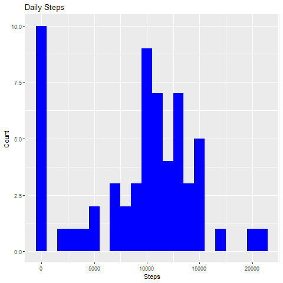

```{r global_options, include=FALSE}
knitr::opts_chunk$set(fig.width=12, fig.height=8, fig.path='Figs/',
                      echo=TRUE, warning=FALSE, message=FALSE)
```

# Assignment 1 Course 5

It is now possible to collect a large amount of data about personal movement using activity monitoring devices such as a Fitbit, Nike Fuelband, or Jawbone Up. These type of devices are part of the quantified self??? movement ??? a group of enthusiasts who take measurements about themselves regularly to improve their health, to find patterns in their behavior, or because they are tech geeks. But these data remain under-utilized both because the raw data are hard to obtain and there is a lack of statistical methods and software for processing and interpreting the data.

This assignment makes use of data from a personal activity monitoring device. This device collects data at 5 minute intervals through out the day. The data consists of two months of data from an anonymous individual collected during the months of October and November, 2012 and include the number of steps taken in 5 minute intervals each day.

## Understanding the DataSet

```{r}
datasetUrl <- "https://d396qusza40orc.cloudfront.net/repdata%2Fdata%2Factivity.zip"
```

Dataset: Activity monitoring data 

The variables included in this dataset are:

steps: Number of steps taking in a 5-minute interval (missing values are coded as \color{red}{\verb|NA|}NA)

date: The date on which the measurement was taken in YYYY-MM-DD format 

interval: Identifier for the 5-minute interval in which measurement was taken

The dataset is stored in a comma-separated-value (CSV) file and there are a total of 17,568 observations in this dataset.


## Geting ready with the environment

Load and install utility packages

install.packages("data.table")  
install.packages("dplyr")  
install.packages("R.utils")  


```{r loadlibrary, results='asis'}
library("R.utils")
library("data.table")
library("dplyr")
library(ggplot2)
library(lattice)
```

```{r results="true"}
packageVersion("data.table")
packageVersion("dplyr")
```


## Load the data

set the current working directory

```{r}
setwd("C:\\Melick\\Bigdata\\Assignments\\5\\51")
```

Download the file and extract to the location

```{r}
download.file(datasetUrl , destfile = "dataset.zip")
if(!dir.exists("Data")){dir.create("Data")}
unzip("dataset.zip",exdir = "Data")
varDataPath <- "Data/activity.csv"
dt <- read.csv(varDataPath,colClasses = c("numeric","Date","numeric"))
```

## Builing the model

load the data to data table for easy analasis and examine the data

```{r  chunk_name, echo=FALSE}
head(dt)
tail(dt)
```

Conver the to data table for easy manupilation


### 1. Calculate the total number of steps taken per day

Group by date and get the sum for each day

```{r , echo=TRUE}
setDT(dt)
Total_Steps <- dt %>% group_by(date) %>% summarise(DailySteps = sum(steps,na.rm = T))
head(Total_Steps,20)
```

### 2. If you do not understand the difference between a histogram and a barplot, research the difference between them. Make a histogram of the total number of steps taken each day

User the ggplot to generate the graph


```{r , echo=TRUE}
p <- ggplot(Total_Steps, aes(x=DailySteps)) +   geom_histogram( fill="blue",binwidth = 1000 ) + labs(title = "Daily Steps" , x = "Steps" , y = "Count" )
print(p)
```



### 3. Calculate and report the mean and median of the total number of steps taken per day

Calculate the Mean

```{r}
mean(Total_Steps$DailySteps,na.rm = TRUE )
```

Calculate the Median
```{r}
median(Total_Steps$DailySteps,na.rm = TRUE )
```

## What is the average daily activity pattern?

### Make a time series plot (i.e.type="l") of the 5-minute interval (x-axis) and the average number of steps taken, averaged across all days (y-axis)

Calculate the steps group by interval and taking the mean

```{r}
steps_interval <- dt %>% group_by(interval) %>% summarise(Steps = mean(steps,na.rm = T))
```

generating the plot using summarize data

```{r}
plot(steps_interval$interval,steps_interval$Steps , type="l", col="red" , lwd=2 , xlab = "Interval" , ylab = "Avg. Steps")
```


### Which 5-minute interval, on average across all the days in the dataset, contains the maximum number of steps?

get the data which is equat to max steps

```{r}
steps_interval %>% filter(steps_interval$Steps == max(steps_interval$Steps))
```

## Imputing missing values

Note that there are a number of days/intervals where there are missing values (coded as NA). The presence of missing days may introduce bias into some calculations or summaries of the data.


### Calculate and report the total number of missing values in the dataset (i.e. the total number of rows with NAs)

```{r}
sum(is.na(dt$steps)==TRUE)
```


### Devise a strategy for filling in all of the missing values in the dataset. The strategy does not need to be sophisticated. For example, you could use the mean/median for that day, or the mean for that 5-minute interval, etc.

User the Median to generate the missing value and load it to new Dataset

```{r}
fillingNAS <- function(x,y) (
  median((dt%>%filter(dt$interval==y))$steps , na.rm = T)
)
dt_filled <- dt %>% mutate( steps = ifelse(is.na(steps),fillingNAS(steps,interval),steps))
```


### Make a histogram of the total number of steps taken each day and Calculate and report the mean and median total number of steps taken per day.

Generating the graph by group by the date

```{r}
dt_filled%>%group_by(date) %>% summarise(steps = sum(steps,na.rm = T))
p <- ggplot(Total_Steps, aes(x=DailySteps)) +   geom_histogram( fill="gray",binwidth = 1000 ) + labs(title = "Daily Steps" , x = "Steps" , y = "Count" )
print(p)
```

Do these values differ from the estimates from the first part of the assignment? yes and different as bellow

```{r}
summary(dt)
summary(dt_filled)
```

What is the impact of imputing missing data on the estimates of the total daily number of steps?

```{r}
sd(dt$steps, na.rm = T)
sd(dt_filled$steps, na.rm = T)
```

## Are there differences in activity patterns between weekdays and weekends?
For this part the weekdays() function may be of some help here. Use the dataset with the filled-in missing values for this part.

```{r}
dt_fact<-dt_filled %>% mutate(factwk = ifelse( 
      weekdays(dt_filled$date) == "Saturday" | weekdays(dt_filled$date) == "Sunday" , "Weekend" ,"Weekday"
    ))
table(dt_fact$factwk)
```


## Make a panel plot containing a time series plot (type="l") of the 5-minute interval (x-axis) and the average number of steps taken, averaged across all weekday days or weekend days (y-axis). See the README file in the GitHub repository to see an example of what this plot should look like using simulated data.


```{r}
dt_graph <- aggregate(steps ~ interval + factwk , dt_fact , FUN = "mean")
xyplot(steps ~ interval | factwk , data=dt_graph, type="l", grid=T, layout=c(1,2), ylab="Number of steps", xlab="5-min. intervals from midnight", main="Average  5-min. activity intervals: Weekdays vs. Weekends")
```
